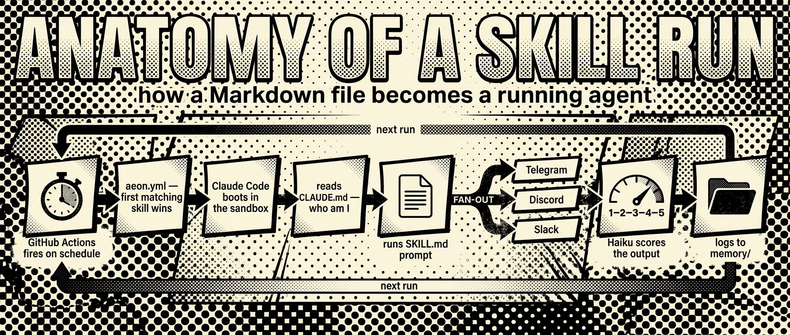
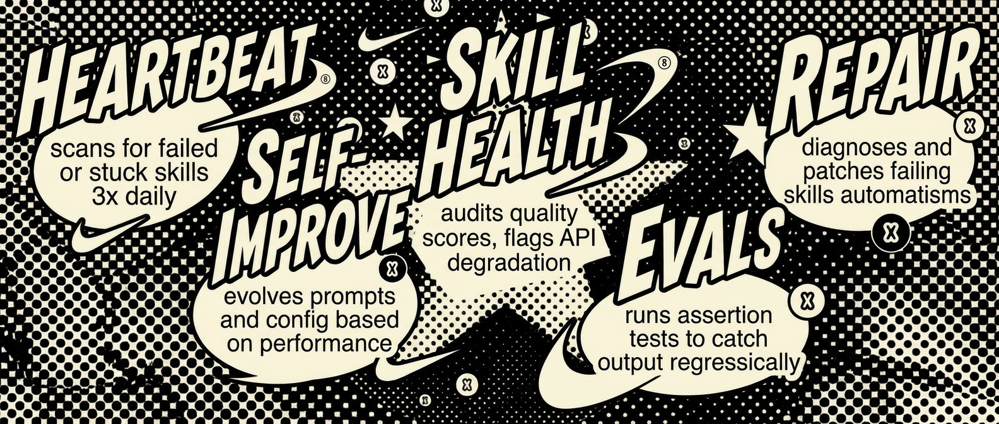
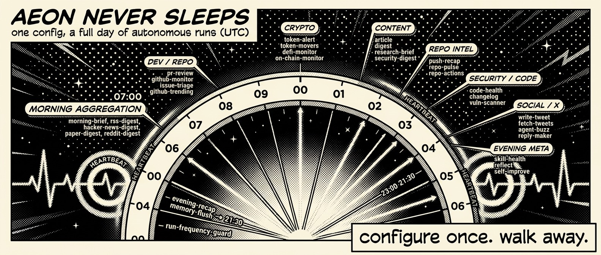
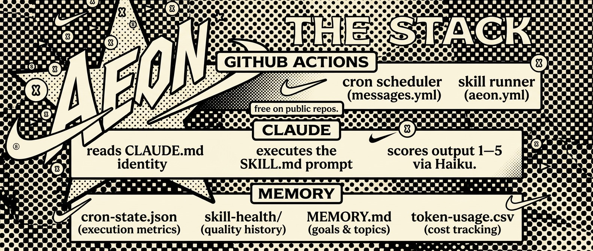
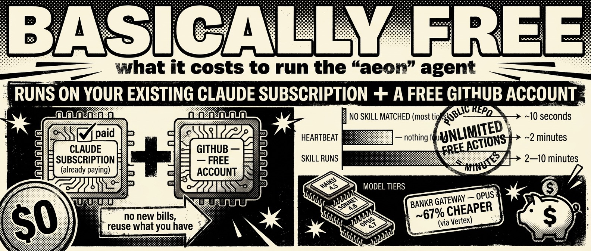
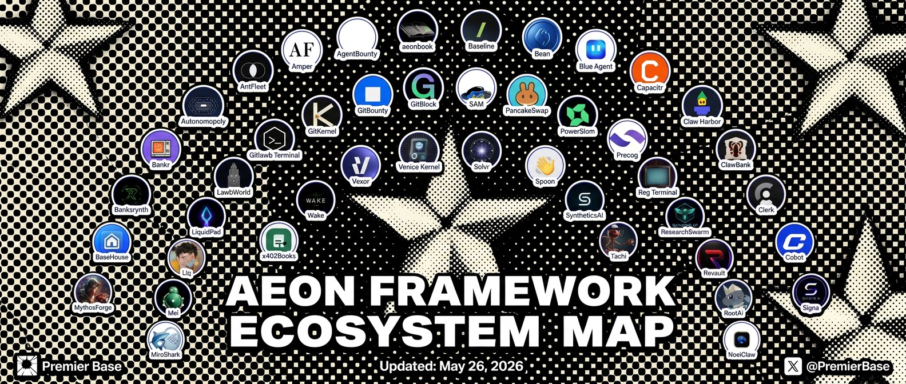

<p align="center">
  
</p>

<h1 align="center">AEON</h1>

<p align="center">
  <a href="https://github.com/aaronjmars/aeon/stargazers"></a>
  <a href="https://github.com/aaronjmars/aeon/network/members"></a>
  <a href="https://x.com/aeonframework"></a>
  <a href="https://bankr.bot/discover/0xbf8e8f0e8866a7052f948c16508644347c57aba3"></a>
</p>

<p align="center">
  <strong>The most autonomous agent framework.</strong><br>
  Give it a direction — it'll leverage 156 skills like deep research, PR reviews, market monitoring, Vercel deploys, and more to get it done. No approval loops. No babysitting. Configure once, forget forever.
</p>

<p align="center">
  
</p>

---

## Why "most autonomous agent framework"?

Most agent tools put you in the driver's seat — approve this tool call, review this diff, confirm this action. That's useful for interactive work. But there's a whole class of tasks where you just want the work *done* while you're not there: morning briefs, market monitoring, PR reviews, research digests, security scans.

Aeon is built for that. Here's how it compares:

|  | Aeon | Claude Code | Hermes | OpenClaw |
|--|------|------------|--------|---------|
| Runs unattended on a schedule | Yes | No | Yes | No |
| Self-heals when skills fail | Yes | No | No | No |
| Monitors its own output quality | Yes | No | No | No |
| Persistent memory across runs | Yes | No | Limited | No |
| Reactive triggers (auto-responds to conditions) | Yes | No | No | No |
| Fixes its own broken skills | Yes | No | No | No |
| Zero infrastructure | Yes (GitHub Actions) | Local | Self-hosted | Self-hosted |
| Reasons about tasks | Yes | Yes | Yes | Yes |

The key difference: **other agents are interactive tools you use. Aeon is an autonomous system you configure and walk away from.** It decides when to run, what to check, and when to bother you. It scores its own output, detects degradation, and patches failing skills without intervention.

This isn't better for everything — you still want Claude Code for writing code interactively. But for the 90% of recurring tasks that don't need you in the loop, the most autonomous agent is the one that never asks.

For a comparison against the broader agent ecosystem (AutoGen, CrewAI, n8n, LangGraph) and a list of active forks running in production, see [`SHOWCASE.md`](SHOWCASE.md). For products and agents built on top of Aeon, see [`ECOSYSTEM.md`](ECOSYSTEM.md).


---

## Quick start

**Prerequisites**

- **Node.js 20+** — the dashboard is a Next.js app.
- **[GitHub CLI](https://cli.github.com/) (`gh`), authenticated.** The dashboard shells out to `gh` for every `/api/*` call (secrets, workflow dispatch, repo metadata). Without it, the Authenticate modal returns 503 and nothing pushes.
  - Install: `brew install gh` (macOS) / `winget install --id GitHub.cli` (Windows) / [other platforms](https://github.com/cli/cli#installation).
  - **No admin / no sudo?** Grab the `gh_*_macOS_arm64.zip` (or your platform's binary) from [github.com/cli/cli/releases](https://github.com/cli/cli/releases) and drop it on your `PATH` (e.g. `~/.local/bin`). No installer needed.
  - Then: `gh auth login`.
- **A repo of your own** to host Aeon (fork this repo or `gh repo create your-name/aeon --public --clone --source=.`). Set it as the default for `gh` once: `gh repo set-default <owner>/<repo>`.

```bash
git clone https://github.com/<you>/aeon
cd aeon && ./aeon
```

`./aeon` prechecks `gh` + auth and bails out early with a clear message if either is missing.

Click on `http://localhost:5555` to open the dashboard in your browser. From there:

1. **Authenticate** — add your Claude API key or OAuth token
2. **Add a channel** — set up [Telegram, Discord, or Slack](#notifications) so Aeon can talk to you (and you can talk back)
3. **Pick skills** — toggle on what you want, set a schedule, and optionally set a `var` to focus each skill
4. **Push** — one click commits and pushes your config to GitHub, Actions takes it from there
5. **Verify** — run `./onboard` to confirm secrets, workflows, memory, and notifications are wired up correctly. Add `--remote` to fire the check inside Actions and have the checklist arrive in your notification channel.

**Need a skill for X?** Six pre-built starters live in [`templates/`](templates/TEMPLATE.md) — crypto tracker, research digest, code reviewer, social monitor, deploy watcher, community manager. Bootstrap one with `./new-from-template <template> <skill-name> --var KEY=VALUE...` and it lands in `skills/` with a disabled entry in `aeon.yml`, ready to enable.

### Dashboard access

The dashboard `/api/*` routes drive `gh workflow run` and read/write the repo's GitHub secrets. They are gated to loopback callers by default — same machine the dashboard is running on, no remote callers, no DNS-rebinding from a malicious page in your browser.

If you need to reach the dashboard from another machine on the same network or over a tunnel (Tailscale, `ngrok`, a reverse proxy), the gate has two env-var hatches:

| Env var | Behaviour |
|---|---|
| `AEON_DASHBOARD_ALLOWED_HOSTS=aeon.local,box.tail-xxx.ts.net` | Extends the loopback allowlist by one or more hostnames (comma-separated, case- and port-insensitive). The defaults stay accepted. |
| `AEON_DASHBOARD_ALLOW_ANY_HOST=1` | Disables Host-header checking entirely. Intended only for a trusted reverse proxy that terminates `Host` upstream. Loudly insecure if set without an authenticating proxy in front. |

The gate also rejects state-changing requests (POST / PUT / PATCH / DELETE) whose `Origin` (or `Referer` fallback) isn't on the same allowlist — so a malicious page on another origin can't drive `/api/secrets` or `/api/skills/.../run` via a no-cors POST. Code lives in [`dashboard/middleware.ts`](dashboard/middleware.ts) + [`dashboard/lib/security/api-gate.ts`](dashboard/lib/security/api-gate.ts).

---

## Skills


156 skills, grouped by what they do. Every skill is independently installable, schedulable, and chainable.

| Category | Skills |
|----------|--------|
| **Research & Content** (24) | `agent-displacement`, `ai-framework-watch`, `article`, `channel-recap`, `competitor-launch-radar`, `deep-research`, `digest`, `fetch-tweets`, `hacker-news-digest`, `huggingface-trending`, `last30`, `launch-radar`, `list-digest`, `paper-digest`, `paper-pick`, `reddit-digest`, `research-brief`, `rss-digest`, `security-digest`, `technical-explainer`, `telegram-digest`, `topic-momentum`, `tweet-digest`, `vibecoding-digest` |
| **Dev & Code** (41) | `auto-merge`, `auto-workflow`, `autoresearch`, `builder-map`, `changelog`, `code-health`, `create-skill`, `deploy-prototype`, `disclosure-tracker`, `ecosystem-pulse`, `external-feature`, `feature`, `fleet-control`, `fork-cohort`, `fork-fleet`, `fork-release-tracker`, `github-issues`, `github-monitor`, `github-releases`, `github-trending`, `issue-triage`, `pr-review`, `pr-tracker`, `pr-triage`, `project-lens`, `push-recap`, `pvr-triage-monitor`, `pvr-watchlist`, `repo-actions`, `repo-article`, `repo-pulse`, `repo-revive`, `repo-scanner`, `search-skill`, `smithery-manifest`, `spawn-instance`, `star-milestone`, `vercel-projects`, `vuln-scanner`, `vuln-tracker`, `workflow-security-audit` |
| **Crypto & Markets** (27) | `aixbt-pulse`, `compute-pulse`, `contributor-reward`, `defi-monitor`, `defi-overview`, `distribute-tokens`, `market-context-refresh`, `monitor-kalshi`, `monitor-polymarket`, `monitor-runners`, `narrative-tracker`, `on-chain-monitor`, `pm-intel`, `pm-manipulation`, `pm-pulse`, `polymarket`, `polymarket-comments`, `price-threshold-alert`, `rwa-pulse`, `token-alert`, `token-movers`, `token-pick`, `token-report`, `treasury-info`, `unlock-monitor`, `wallet-digest`, `x402-monitor` |
| **Social & Writing** (14) | `agent-buzz`, `create-campaign`, `engagement-act`, `farcaster-digest`, `product-hunt-launch`, `refresh-x`, `remix-tweets`, `reply-maker`, `schedule-ads`, `show-hn-draft`, `syndicate-article`, `thread-formatter`, `tweet-roundup`, `write-tweet` |
| **Productivity** (18) | `action-converter`, `daily-routine`, `deal-flow`, `evening-recap`, `goal-tracker`, `idea-capture`, `idea-pipeline`, `idea-validator`, `milestone-tracker`, `morning-brief`, `note-taking`, `reflect`, `reg-monitor`, `startup-idea`, `tool-builder`, `v4-readiness`, `weekly-review`, `weekly-shiplog` |
| **Meta / Agent** (32) | `batch-health`, `config-validator`, `contributor-spotlight`, `cost-report`, `fleet-state`, `fork-contributor-leaderboard`, `fork-first-run-alert`, `fork-skill-digest`, `fork-skill-gap`, `heartbeat`, `janitor`, `memory-flush`, `memory-structural-dedupe`, `onboard`, `operator-scorecard`, `run-frequency-guard`, `rss-feed`, `self-improve`, `self-review`, `signal-verdict`, `skill-analytics`, `skill-enabler`, `skill-evals`, `skill-freshness`, `skill-graph`, `skill-health`, `skill-leaderboard`, `skill-repair`, `skill-security-scan`, `skill-update-check`, `star-momentum-alert`, `update-gallery` |

Full descriptions: [`skills.json`](skills.json) — or run `./add-skill aaronjmars/aeon --list`

**Dependency graph:** [`docs/skill-graph.md`](docs/skill-graph.md) — visual map of how skills connect, grouped by category with the self-healing loop and content pipeline highlighted

---

### Instance Fleet

Aeon can spawn and manage copies of itself via `spawn-instance`, `fleet-control`, and `fork-fleet`. Use this to run specialized instances — one for crypto monitoring, another for research, etc.

Spawn with `var: "crypto-tracker: monitor DeFi protocols and token movements"`. The skill forks the repo, selects relevant skills, and registers it in `memory/instances.json`. No secrets are propagated — the new owner adds their own keys.

---

## Authentication

Set **one** of these — not both:

| Secret | What it is | Billing |
|--------|-----------|---------|
| `CLAUDE_CODE_OAUTH_TOKEN` | OAuth token from your Claude Pro/Max subscription | Included in plan |
| `ANTHROPIC_API_KEY` | API key from console.anthropic.com | Pay per token |

**Getting an OAuth token:**
```bash
claude setup-token   # opens browser → prints sk-ant-oat01-... (valid 1 year)
```

### Bankr Gateway (optional)

Route requests through [Bankr LLM Gateway](https://docs.bankr.bot/llm-gateway/overview) for ~67% cheaper Opus (via Vertex AI) and access to Gemini, GPT, Kimi, and Qwen models.

1. Get a key at [bankr.bot/api](https://bankr.bot/api) and top up credits
2. Add `BANKR_LLM_KEY` as a repo secret
3. Set `gateway: { provider: bankr }` in `aeon.yml`

---

## Soul (optional)

By default Aeon has no personality. To make it write and respond like you, add a soul:

1. Fork [soul.md](https://github.com/aaronjmars/soul.md) and fill in your files:
   - `SOUL.md` — identity, worldview, opinions, interests
   - `STYLE.md` — voice, sentence patterns, vocabulary, tone
   - `examples/good-outputs.md` — 10–20 calibration samples
2. Copy into your Aeon repo under `soul/`
3. Add to the top of `CLAUDE.md`:

```markdown
## Identity

Read and internalize before every task:
- `soul/SOUL.md` — identity and worldview
- `soul/STYLE.md` — voice and communication patterns
- `soul/examples.md` — calibration examples

Embody this identity in all output. Never hedge with "as an AI."
```

Every skill reads `CLAUDE.md`, so identity propagates automatically.

**Quality check:** soul files work when they're specific enough to be wrong. *"I think most AI safety discourse is galaxy-brained cope"* is useful. *"I have nuanced views on AI safety"* is not.

---

## Quality scoring & self-healing



Every skill output is automatically scored 1–5 by Haiku after each run (failed/empty → 1, excellent → 5). Scores and flags (`api_error`, `stale_data`, `rate_limited`) are tracked per skill in `memory/skill-health/` with a rolling 30-run history.

**Heartbeat** is the only skill enabled by default. Runs 3x daily, checks `memory/cron-state.json` for failed, stuck, or chronically broken skills, stalled PRs, and missed schedules. Nothing to report → logs `HEARTBEAT_OK`. Something needs attention → sends one notification. Listed last in `aeon.yml` so it only fires when no other skill claims the slot.

### Self-healing loop



1. **`heartbeat`** (3x daily) — detects failed, stuck, or chronically broken skills
2. **`skill-health`** — audits quality scores and flags API degradation patterns
3. **`skill-evals`** — assertion-based output quality tests to catch regressions
4. **`skill-repair`** — diagnoses and patches failing skills automatically
5. **`self-improve`** — evolves prompts, config, and workflows based on performance

### Reactive triggers

Skills with `schedule: "reactive"` fire on conditions, not cron. If any skill fails 3x in a row, `skill-repair` auto-fires. The scheduler evaluates triggers after processing cron skills.

```yaml
reactive:
  skill-repair:
    trigger:
      - { on: "*", when: "consecutive_failures >= 3" }
```

### Cost tracking

Every run logs token usage to `memory/token-usage.csv`. The `cost-report` skill generates a weekly breakdown by skill and model.

---

## Configuration



All scheduling lives in `aeon.yml`:

```yaml
skills:
  article:
    enabled: true               # flip to activate
    schedule: "0 8 * * *"       # daily at 8am UTC
  digest:
    enabled: true
    schedule: "0 14 * * *"
    var: "solana"               # topic for this skill
```

Standard cron format. All times UTC. Supports `*`, `*/N`, exact values, comma lists.

**Order matters** — the scheduler picks the first matching skill. Put day-specific skills (e.g. Monday-only) before daily ones. Heartbeat goes last.

### The `var` field

Every skill accepts a single `var` — a universal input that each skill interprets in its own way:

| Skill type | What `var` does | Example |
|-----------|----------------|---------|
| Research & content | Sets the topic | `var: "rust"` → digest about Rust |
| Dev & code | Narrows to a repo | `var: "owner/repo"` → only review that repo's PRs |
| Crypto | Focuses on a token/wallet | `var: "solana"` → only check SOL price |
| Productivity | Sets the focus area | `var: "shipping v2"` → morning brief emphasizes v2 |

If `var` is empty, each skill falls back to its default behavior (scan everything, auto-pick topics, etc.). Set it from the dashboard or pass it when triggering manually.

### Model selection

The default model for all skills is set in `aeon.yml`:

```yaml
model: claude-opus-4-8
```

You can change it from the dashboard header dropdown. Options: `claude-opus-4-8`, `claude-sonnet-4-6`, `claude-haiku-4-5-20251001`. Per-run overrides are also available via workflow dispatch.

Individual skills can override the default model to optimize cost:

```yaml
skills:
  token-report: { enabled: true, schedule: "30 12 * * *", model: "claude-sonnet-4-6" }
  skill-evals: { enabled: true, schedule: "0 6 * * 0", model: "claude-sonnet-4-6" }
```

### Skill Chaining

Skills can be chained together so outputs flow between them. Chains run as separate GitHub Actions workflow steps via `chain-runner.yml`.

```yaml
chains:
  morning-pipeline:
    schedule: "0 7 * * *"
    on_error: fail-fast       # or: continue
    steps:
      - parallel: [token-movers, hacker-news-digest]  # run concurrently
      - skill: morning-brief                         # runs after parallel group
        consume: [token-movers, hacker-news-digest]  # gets their outputs injected
```

How it works:
1. Each step runs as a separate workflow dispatch
2. After each skill completes, its output is saved to `.outputs/{skill}.md`
3. Downstream steps with `consume:` get prior outputs injected into context
4. Steps can run in parallel or sequentially
5. `on_error: fail-fast` aborts the chain on any failure; `continue` keeps going

Define chains in `aeon.yml` alongside your skills. The scheduler dispatches them on their own cron schedule.

---

### Changing check frequency

Edit `.github/workflows/messages.yml`:

```yaml
schedule:
  - cron: '*/5 * * * *'    # every 5 min (default)
  - cron: '*/15 * * * *'   # every 15 min (saves Actions minutes)
  - cron: '0 * * * *'      # hourly (most conservative)
```

Claude only installs and runs when a skill actually matches.

---

## Project structure



```
CLAUDE.md                ← agent identity (auto-loaded by Claude Code)
aeon.yml                 ← skill schedules, chains, reactive triggers, and enabled flags
skills.json              ← machine-readable skill catalog (156 skills)
./aeon                   ← launch the local dashboard (Next.js on port 5555)
./onboard                ← validate the fork's setup (secrets, workflows, channels) — see Quick start
./notify                 ← multi-channel notifications (Telegram, Discord, Slack, Email, json-render)
./notify-jsonrender      ← convert skill output to dashboard feed cards via Haiku
./add-skill              ← import skills from GitHub repos (with security scanning)
./add-mcp                ← register Aeon as an MCP server for Claude Desktop/Code
./add-a2a                ← start the A2A protocol gateway for external agents
./export-skill           ← package skills for standalone distribution
./generate-skills-json   ← regenerate skills.json from SKILL.md files
docs/                    ← GitHub Pages site (articles, activity log, memory)
soul/                    ← optional identity files (SOUL.md, STYLE.md, examples/, data/)
skills/                  ← each skill is a SKILL.md prompt file
  article/
  digest/
  heartbeat/
  ...                    ← 156 skills total
workflows/               ← GitHub Agentic Workflow templates (.md)
mcp-server/              ← MCP server — exposes skills as Claude tools
a2a-server/              ← A2A protocol gateway — exposes skills to any agent framework
dashboard/               ← local web UI (Next.js + json-render feed)
memory/
  MEMORY.md              ← goals, active topics, pointers
  cron-state.json        ← per-skill execution metrics (status, success rate, quality)
  skill-health/          ← rolling quality scores per skill (last 30 runs)
  token-usage.csv        ← token cost tracking per run
  issues/                ← structured issue tracker for skill failures
  topics/                ← detailed notes by topic
  logs/                  ← daily activity logs (YYYY-MM-DD.md)
.outputs/                ← skill chain outputs (passed between chained steps)
scripts/
  prefetch-xai.sh        ← pre-fetch X/Grok API data outside sandbox
  postprocess-replicate.sh ← generate images via Replicate after Claude runs
  skill-runs             ← audit recent GitHub Actions skill runs
  sync-site-data.sh      ← sync memory/logs to docs site data
.github/workflows/
  aeon.yml               ← skill runner (workflow_dispatch, issues, quality scoring)
  chain-runner.yml       ← skill chain executor (parallel + sequential pipelines)
  messages.yml           ← cron scheduler + message polling (Telegram/Discord/Slack)
```

---

## GitHub Actions cost



| Scenario | Cost |
|----------|------|
| No skill matched (most ticks) | ~10s — checkout + bash + exit |
| Skill runs | 2–10 min depending on complexity |
| Heartbeat (nothing found) | ~2 min |
| **Public repo** | **Unlimited free minutes** |

To reduce usage: switch to `*/15` or hourly cron, disable unused skills, keep the repo public.

| Plan | Free minutes/mo | Overage |
|------|----------------|---------|
| Free | 2,000 | N/A (private only) |
| Pro / Team | 3,000 | $0.008/min |

---

## Notifications

Set the secret → channel activates. No code changes needed.

| Channel | Outbound | Inbound |
|---------|---------|---------|
| Telegram | `TELEGRAM_BOT_TOKEN` + `TELEGRAM_CHAT_ID` | Same |
| Discord | `DISCORD_WEBHOOK_URL` | `DISCORD_BOT_TOKEN` + `DISCORD_CHANNEL_ID` |
| Slack | `SLACK_WEBHOOK_URL` | `SLACK_BOT_TOKEN` + `SLACK_CHANNEL_ID` |
| Email | `SENDGRID_API_KEY` + `NOTIFY_EMAIL_TO` | — |

**Telegram:** Create a bot with @BotFather → get token + chat ID.  
**Discord:** Outbound: Channel → Integrations → Webhooks → Create. Inbound: discord.com/developers → bot → add `channels:history` scope → copy token + channel ID.  
**Slack:** api.slack.com → Create App → Incoming Webhooks → install → copy URL. Inbound: add `channels:history`, `reactions:write` scopes → copy bot token + channel ID.  
**Email:** sendgrid.com/settings/api_keys → Create API Key (Mail Send permission) → add as `SENDGRID_API_KEY`. Set `NOTIFY_EMAIL_TO` to your recipient address. Optional: set repository variable `NOTIFY_EMAIL_FROM` (default: `aeon@notifications.aeon.bot`) and `NOTIFY_EMAIL_SUBJECT_PREFIX` (default: `[Aeon]`).

### Telegram instant mode (optional)

Default polling has up to 5-min delay. Deploy a ~20-line Cloudflare Worker as a webhook for ~1s response time. See [`docs/telegram-instant.md`](docs/telegram-instant.md) for the Worker code and setup.

---

## Cross-repo access

The built-in `GITHUB_TOKEN` is scoped to this repo only. For `github-monitor`, `pr-review`, `issue-triage`, and `external-feature` to work on your other repos, add a `GH_GLOBAL` personal access token.

| | `GITHUB_TOKEN` | `GH_GLOBAL` |
|--|--------------|------------|
| Scope | This repo | Any repo you grant |
| Created by | GitHub (automatic) | You (manual) |
| Lifetime | Job duration | Up to 1 year |

**Setup:** github.com/settings/tokens → Fine-grained → set repo access → grant Contents, Pull requests, Issues (all read/write) → add as `GH_GLOBAL` secret.

Skills use `GH_GLOBAL` when available, fall back to `GITHUB_TOKEN` automatically.

---

## Adding skills

### Install external skills

```bash
./add-skill BankrBot/skills --list          # browse a repo's skills
./add-skill BankrBot/skills bankr hydrex   # install specific skills
./add-skill BankrBot/skills --all           # install everything
```

Installed skills land in `skills/` and are added to `aeon.yml` disabled. Flip `enabled: true` to activate.

### Install from Aeon's catalog

Every skill is independently installable. Browse the catalog in [`skills.json`](skills.json) or:

```bash
./add-skill aaronjmars/aeon --list                                       # browse
./add-skill aaronjmars/aeon token-alert monitor-polymarket                # install specific
./add-skill aaronjmars/aeon --all                                         # install everything
```

### Export a skill

```bash
./export-skill token-alert              # exports to ./exports/token-alert/
```

### Trigger feature builds from issues

Label any GitHub issue `ai-build` → workflow fires → Claude reads the issue, implements it, opens a PR.

---

## Community skill packs



Third-party skill collections that live in their own repos. Aeon doesn't ship them in the core catalog, but they install as one bundle via [`./install-skill-pack`](install-skill-pack):

```bash
./install-skill-pack baseddevoloper/aeon-skill-pack-vvvkernel
```

The script reads a `skills-pack.json` manifest from the pack root (or falls back to scanning `skills/`), runs the security scanner on each declared `SKILL.md`, and copies approved skills into `skills/` with rows added to `skills.json`, entries in `aeon.yml` (disabled), and provenance in `skills.lock`. Full schema and trust model in [`docs/community-skill-packs.md`](docs/community-skill-packs.md).

To browse known packs without installing, run `./install-skill-pack --list` — it reads the machine-readable registry in [`skill-packs.json`](skill-packs.json) (mirror of the table below).

| Pack | Skills | Description |
|------|--------|-------------|
| [aeon-skill-pack-vvvkernel](https://github.com/baseddevoloper/aeon-skill-pack-vvvkernel) | 9 | Venice AI inference via VVVKernel — onchain, audit, growth, narrative, image gen, monitoring |
| [luca-aeon-skills](https://github.com/danbuildss/luca-aeon-skills) | 4 | Financial intelligence via x402Books AI — wallet scanning, treasury monitoring, financial reports, and agent registry on Base |
| [zer0-skill-pack](https://github.com/0xShak/zer0-skill-pack) | 6 | Polymarket intelligence — daily thesis, mispricing scanner, contrarian fades, narrative-vs-markets, paper-trade PnL journal, alpha comment curator |
| [gitbounty-skill-pack](https://github.com/gitlawbounty/gitbounty-skill-pack) | 1 | Bounty hunting on the gitlawb network via gitbounty — discover open bounties, scout the best fit with the gitbounty LLM scout, draft a solution plan (read-only) |
| [aeon-skills](https://github.com/AntFleet/aeon-skills) | 1 | Two-model-consensus PR review (Opus 4.7 + GPT-5) — per-review USDC drawdown on Base |
| [aeon-skill-pack-liquidpad](https://github.com/liquidpadbot/aeon-skill-pack-liquidpad) | 4 | Track LiquidPad on Base — burn cycle alerts, new token launches with onchain provenance, daily protocol digest, and fee accrual tracking |
| [aeon-skill-pack-mythosforge](https://github.com/ryjin111/aeon-skill-pack-mythosforge) | 5 | Read-only MythosForge monitoring — ops/backlog/jury/payout health, proof-of-creation integrity on Base, theme/round guard against silent relabels, jury-drift detection, and live gallery/proof-page QA |
| [demo-pack](https://github.com/sparkleware/demo-pack) | 1 | Holographic demo skill — proves the Sparkleware registry install pipeline works |
| [aeon-pulse](https://github.com/sparkleware/aeon-pulse) | 1 | Daily activity summary for the Aeon framework — recent commits, releases, and open issues |
| [registry-watch](https://github.com/sparkleware/registry-watch) | 1 | Daily digest of new packs added to the Sparkleware registry — discover community skills without manually browsing |
| [arxiv-digest](https://github.com/sparkleware/arxiv-digest) | 1 | Daily digest of newest AI / autonomous-agent papers on arXiv — top submissions in cs.AI, cs.LG, cs.MA |
| [hn-top](https://github.com/sparkleware/hn-top) | 1 | Daily digest of HackerNews top stories — dev / startup / AI conversation in one screen |
| [eth-gas-watch](https://github.com/sparkleware/eth-gas-watch) | 1 | Ethereum gas-price status check on a schedule — flags cheap windows for batching on-chain ops |
| [morning-briefing](https://github.com/sparkleware/morning-briefing) | 1 | Daily morning briefing — date, day-of-week, current weather, and a sparkly closer |
| [aeon-skill-pack-noelclaw](https://github.com/noelclaw/aeon-skill-pack-noelclaw) | 2 | Persistent versioned memory and multi-agent swarm coordination — save typed artifacts to Noel Vault and manage shared agent session state across runs |
| [signa](https://github.com/codexvritra/signa) (`--path aeon-skills`) | 10 | Full SIGNA suite — wallet-signed cross-platform agent messaging, multi-agent broadcast and delegate, plus Bankr resolver / launches, gitlawb activity, MiroShark sim stats and wallet-signed sim fire |

**To list a pack here**, open a PR adding a row. Guidelines:

- The pack must be in its own public repo with a clear license and a per-skill `SKILL.md`.
- Skills should follow the conventions in [`add-skill`](add-skill) and the core catalog — no monkey-patching of Aeon internals, no skill that depends on private endpoints.
- Add a `skills-pack.json` manifest at the pack root so `install-skill-pack` knows which skills the pack ships (see [docs](docs/community-skill-packs.md) for the schema).
- The README row should link to the repo, name the skill count, and one-line what the pack is for.
- In the same PR, add a matching entry to [`skill-packs.json`](skill-packs.json) at this repo's root — the machine-readable mirror of the table that `./install-skill-pack --list` reads (registry schema in [the docs](docs/community-skill-packs.md#skill-packsjson-community-registry)).

This is the lightweight surface: it gives community packs visibility without coupling them to the core catalog's release cadence.

---

## Publishing

Aeon publishes articles to a GitHub Pages gallery and an RSS feed.

**GitHub Pages:** Enable in **Settings → Pages** → source `Deploy from a branch`, branch `main`, folder `/docs`. The site lives at `https://<username>.github.io/aeon` with articles, activity logs, and memory. The `update-gallery` skill keeps it in sync.

**RSS:** Subscribe at `https://raw.githubusercontent.com/<owner>/<repo>/main/articles/feed.xml` — works with any RSS reader. Regenerated after each content skill runs.

---

## Integrations (MCP & A2A)

Aeon skills work outside GitHub Actions too — use them from Claude or any AI agent framework.

**Claude (MCP)** — every skill appears as an `aeon-<name>` tool in Claude Desktop and Claude Code:

```bash
./add-mcp                    # build and register
./add-mcp --desktop          # also print Claude Desktop config
./add-mcp --uninstall        # remove
```

**Any AI agent (A2A)** — [Google's A2A protocol](https://google.github.io/A2A/) lets LangChain, AutoGen, CrewAI, OpenAI Agents SDK, and Vertex AI invoke skills via HTTP:

```bash
./add-a2a                    # starts on port 41241
./add-a2a --print-config     # LangChain/Python client examples
```

Skills run locally via `claude -p -`, identical to Actions. API keys read from your environment or a `.env` file in the repo root.

### Integration examples

Working client scripts for every supported stack live in [`examples/`](examples/) — each one is &lt;100 lines, talks to a running A2A gateway or MCP server, and calls a real Aeon skill end-to-end:

| Stack | File | Skill called |
|-------|------|--------------|
| LangChain | [`examples/a2a/langchain_client.py`](examples/a2a/langchain_client.py) | `aeon-fetch-tweets` |
| AutoGen | [`examples/a2a/autogen_workflow.py`](examples/a2a/autogen_workflow.py) | `aeon-deep-research` |
| CrewAI | [`examples/a2a/crewai_task.py`](examples/a2a/crewai_task.py) | `aeon-pr-review` |
| OpenAI Agents SDK | [`examples/a2a/openai_agents_client.py`](examples/a2a/openai_agents_client.py) | `aeon-token-report` |
| MCP (stdio) | [`examples/mcp/test_connection.py`](examples/mcp/test_connection.py) | `aeon-cost-report` |
| Claude Desktop | [`examples/mcp/claude_desktop_config.json`](examples/mcp/claude_desktop_config.json) | — |

Start with [`examples/README.md`](examples/README.md) for the full setup walk-through.

---

## Fleet Watcher (optional authorization layer)

Add inline ALLOW/BLOCK authorization in front of every skill run. Each skill workflow asks your self-hosted [Fleet Watcher](https://github.com/yourorg/fleet-watcher) control plane *"is this allowed?"* before Claude starts, and reports the outcome after Claude finishes. BLOCK = workflow exits non-zero, Claude never runs, no side-effects, audit ref recorded.

Already wired into `.github/workflows/aeon.yml` as two opt-in steps (`Fleet Watcher preflight`, `Fleet Watcher postflight`). To enable:

1. Stand up Fleet Watcher and mint an agent token via `POST /api/aeon/register`.
2. Add two repo secrets:

    | Secret           | Value                                           |
    |------------------|-------------------------------------------------|
    | `FLEET_ENDPOINT` | Base URL of your Fleet Watcher (e.g. `https://fleet.example.com`) |
    | `FLEET_TOKEN`    | The `agnt_…` token returned by `/api/aeon/register` |

3. Define your red lines in the Fleet Watcher dashboard (per-skill caps, counterparty allowlists, dangerous-string patterns, source-to-sink chain detection).

If the secrets are not set, both steps no-op — fully backward compatible with every existing AEON install. If Fleet is unreachable when the secrets *are* set, the preflight step fails closed (skill does not run). The postflight step always runs (`if: always()`) so failed/blocked skills are still recorded for taint analysis.

---

## Two-repo strategy

This repo is a public template. Run your own instance as a **private fork** so memory, articles, and API keys stay private.

```bash
# Pull template updates into your private fork
git remote add upstream https://github.com/aaronjmars/aeon.git
git fetch upstream
git merge upstream/main --no-edit
```

Your `memory/`, `articles/`, and personal config won't conflict — they're in files that don't exist in the template.

---

## Star History

[](https://www.star-history.com/#aaronjmars/aeon&Date)

Support the project : 0xbf8e8f0e8866a7052f948c16508644347c57aba3

---

## ❓ FAQ

### What is Aeon?

Aeon is "the most autonomous agent framework" — an AI agent system that runs unattended, self-heals when skills fail, and monitors its own output quality. Configure once, walk away, and it handles recurring tasks like morning briefs, market monitoring, PR reviews, and research digests.

### How does Aeon differ from Claude Code, Hermes, or OpenClaw?

| Feature | Aeon | Claude Code | Hermes | OpenClaw |
|---------|------|-------------|--------|----------|
| Runs unattended on schedule | Yes | No | Yes | No |
| Self-heals failing skills | Yes | No | No | No |
| Monitors output quality | Yes | No | No | No |
| Persistent memory | Yes | No | Limited | No |
| Reactive triggers | Yes | No | No | No |
| Fixes broken skills | Yes | No | No | No |
| Zero infrastructure | Yes (GitHub Actions) | Local | Self-hosted | Self-hosted |

**Key difference**: Other agents are interactive tools you use. Aeon is an autonomous system you configure and leave alone.

### How many built-in skills does Aeon have?

156 skills across 6 categories:
- **Research & Content** (24): deep-research, paper-digest, rss-digest, etc.
- **Dev & Code** (41): pr-review, github-monitor, auto-merge, etc.
- **Crypto & Markets** (27): defi-monitor, token-alert, polymarket monitoring, etc.
- **Social & Writing** (14): write-tweet, syndicate-article, product-hunt-launch, etc.
- **Productivity** (18): morning-brief, weekly-review, goal-tracker, etc.
- **Meta / Agent** (32): skill-repair, self-improve, fleet-state, etc.

### How do I get started?

```bash
git clone https://github.com/aaronjmars/aeon
cd aeon && ./aeon
```

Then:
1. Open `http://localhost:5555` in your browser
2. Add your Claude API key
3. Set up notification channel (Telegram/Discord/Slack)
4. Toggle skills and set schedules
5. Push config to GitHub — Actions handles the rest
6. Run `./onboard` to verify setup

### What LLM providers does Aeon support?

Aeon primarily uses Claude (Anthropic) via API key or OAuth token. Check the dashboard for authentication options.

### What is the skill dependency graph?

See [`docs/skill-graph.md`](docs/skill-graph.md) — a visual map showing how 156 skills connect, with the self-healing loop and content pipeline highlighted.

### Can I create custom skills?

Yes. Use templates from [`templates/`](templates/TEMPLATE.md):
- Crypto tracker
- Research digest
- Code reviewer
- Social monitor
- Deploy watcher
- Community manager

Bootstrap: `./new-from-template <template> <skill-name> --var KEY=VALUE...`

### What is Instance Fleet?

Aeon can spawn specialized copies of itself via `spawn-instance`, `fleet-control`, and `fork-fleet`. Each instance runs a focused skill set (e.g., crypto monitoring, research). New owners add their own secrets.

### How does self-healing work?

Aeon's Meta/Agent skills (`skill-repair`, `self-improve`, `skill-health`) detect failing skills, diagnose issues, and patch them automatically without human intervention.

### What notifications are supported?

Telegram, Discord, and Slack. Set up in the dashboard to receive output and interact with Aeon.

### How does Aeon run?

Aeon runs on GitHub Actions with zero infrastructure needed. After pushing your config, Actions executes skills on schedule. You can also run locally via `./aeon`.

### What is the autonomy spectrum?

See `assets/autonomy.jpg`. Aeon sits at the "fully autonomous" end — it decides when to run, what to check, and when to notify you. Other tools require approval loops and babysitting.

### Troubleshooting

**Issue**: Dashboard not loading
- Ensure `./aeon` is running
- Check `http://localhost:5555` port

**Issue**: Skills not executing
- Run `./onboard --remote` to verify setup in Actions
- Check GitHub Actions workflow status

**Issue**: Notifications not working
- Verify channel configuration in dashboard
- Check Telegram/Discord/Slack API tokens

**Issue**: Self-healing not working
- Enable `skill-repair` and `skill-health` skills
- Check memory state in `memory/` directory

### Need more help?

- Check [`docs/`](docs/) directory
- Run `./onboard` for setup verification
- Open an issue on GitHub
