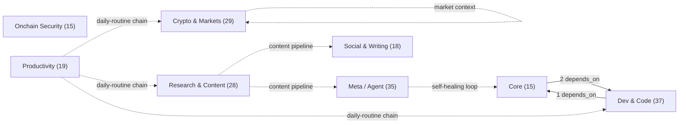
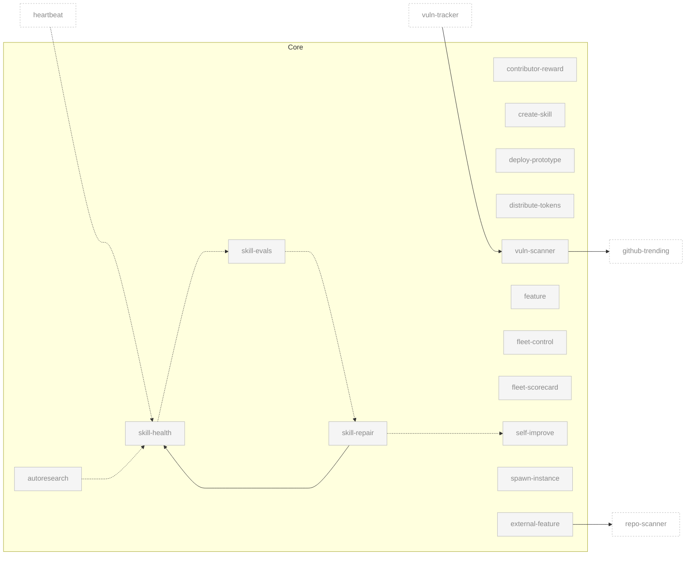
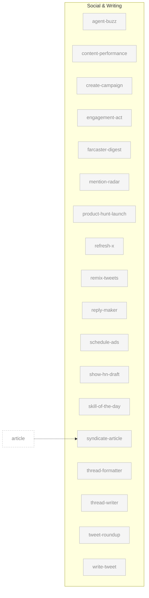

# Skill Dependency Graph

> Auto-generated by `skill-graph` on 2026-06-09. Re-run the skill to update. Mode: `SKILL_GRAPH_OK`

**Verdict:** `NEW_SKILLS: +105 since 2026-04-17 · CATEGORIES: 5 → 8 · NEW_DEPS: vuln-tracker→vuln-scanner`

Visual map of all **196 Aeon skills** grouped by the 8 canonical categories, with dependency edges showing how skills connect.

## What changed since the last map (2026-04-17)

- **Skills: 91 → 196.** The catalog more than doubled; every category below reflects the current `skills.json` inventory.
- **Categories: 5 → 8.** `Core` (the load-bearing set), `Onchain Security`, and `Meta / Agent` were split out of the old Dev/Productivity groupings.
- **New dependency edge:** `vuln-tracker --> vuln-scanner` (tracker consumes the scanner's disclosure state).
- Chains and reactive triggers in `aeon.yml` ship as commented templates — the `daily-routine` chain below is shown as the canonical example.

## Legend

| Edge | Meaning |
|------|---------|
| `-->` solid | `depends_on` — skill requires another to run first |
| `-.->` dashed | `consume` — chain step receives output from a prior step |
| `-..->` dotted | reactive trigger or shared-state dependency |

Bold/white nodes are **enabled** in `aeon.yml` (with their cron schedule); grey nodes ship disabled. Dashed ghost nodes in per-category diagrams live in another category. Every node links to its `SKILL.md`.

> Every skill also writes `memory/cron-state.json`, which the self-healing loop reads — collapsed here into the loop callout rather than drawn as 196 edges.

---

## Architecture Overview

Cross-category edges only — drill into the per-category diagrams below for skill-level detail.



---

## Self-Healing Loop

The most important chain in Aeon — five skills form a closed loop that detects, diagnoses, and fixes problems without human intervention:

```mermaid
flowchart LR
    state[("memory/cron-state.json<br/>memory/skill-health/")]
    heartbeat["heartbeat · 0 8,14,20 * * *"]
    skill-health[skill-health]
    skill-evals[skill-evals]
    skill-repair[skill-repair]
    self-improve[self-improve]

    heartbeat -..-> skill-health -..-> skill-evals -..-> skill-repair -..-> self-improve
    state -..-> heartbeat
    skill-repair -..-> state

    classDef default fill:#f5f5f5,stroke:#bbb,color:#888
    classDef enabled fill:#fff,stroke:#000,stroke-width:2px,color:#000
    classDef external fill:none,stroke:#bbb,stroke-dasharray:3 3,color:#888
    class heartbeat enabled
    click heartbeat "../skills/heartbeat/SKILL.md"
    click skill-health "../skills/skill-health/SKILL.md"
    click skill-evals "../skills/skill-evals/SKILL.md"
    click skill-repair "../skills/skill-repair/SKILL.md"
    click self-improve "../skills/self-improve/SKILL.md"
```



`heartbeat` detects failures → `skill-health` classifies severity → `skill-evals` catches quality regressions → `skill-repair` patches broken skills → `self-improve` evolves prompts and config. Health skills file issues in `memory/issues/`; repair skills close them.

---

## Per-Category Maps

### Core (15)



### Research & Content (28)

```mermaid
flowchart LR
    subgraph research ["Research & Content"]
        agent-displacement[agent-displacement]
        ai-framework-watch[ai-framework-watch]
        article[article]
        article-queue[article-queue]
        beat-tracker[beat-tracker]
        channel-recap[channel-recap]
        competitor-launch-radar[competitor-launch-radar]
        deep-research[deep-research]
        digest[digest]
        fetch-tweets[fetch-tweets]
        hacker-news-digest[hacker-news-digest]
        huggingface-trending[huggingface-trending]
        last30[last30]
        launch-radar[launch-radar]
        list-digest[list-digest]
        mcp-pulse[mcp-pulse]
        narrative-convergence[narrative-convergence]
        paper-digest[paper-digest]
        paper-pick[paper-pick]
        reddit-digest[reddit-digest]
        research-brief[research-brief]
        rss-digest[rss-digest]
        security-digest[security-digest]
        technical-explainer[technical-explainer]
        telegram-digest[telegram-digest]
        topic-momentum[topic-momentum]
        tweet-digest[tweet-digest]
        vibecoding-digest[vibecoding-digest]
    end

    daily-routine[daily-routine]:::external
    rss-feed[rss-feed]:::external
    syndicate-article[syndicate-article]:::external
    update-gallery[update-gallery]:::external

    daily-routine -.-> paper-pick
    daily-routine -.-> hacker-news-digest
    article -..-> syndicate-article
    article -..-> rss-feed
    article -..-> update-gallery

    classDef default fill:#f5f5f5,stroke:#bbb,color:#888
    classDef enabled fill:#fff,stroke:#000,stroke-width:2px,color:#000
    classDef external fill:none,stroke:#bbb,stroke-dasharray:3 3,color:#888
    click agent-displacement "../skills/agent-displacement/SKILL.md"
    click ai-framework-watch "../skills/ai-framework-watch/SKILL.md"
    click article "../skills/article/SKILL.md"
    click article-queue "../skills/article-queue/SKILL.md"
    click beat-tracker "../skills/beat-tracker/SKILL.md"
    click channel-recap "../skills/channel-recap/SKILL.md"
    click competitor-launch-radar "../skills/competitor-launch-radar/SKILL.md"
    click deep-research "../skills/deep-research/SKILL.md"
    click digest "../skills/digest/SKILL.md"
    click fetch-tweets "../skills/fetch-tweets/SKILL.md"
    click hacker-news-digest "../skills/hacker-news-digest/SKILL.md"
    click huggingface-trending "../skills/huggingface-trending/SKILL.md"
    click last30 "../skills/last30/SKILL.md"
    click launch-radar "../skills/launch-radar/SKILL.md"
    click list-digest "../skills/list-digest/SKILL.md"
    click mcp-pulse "../skills/mcp-pulse/SKILL.md"
    click narrative-convergence "../skills/narrative-convergence/SKILL.md"
    click paper-digest "../skills/paper-digest/SKILL.md"
    click paper-pick "../skills/paper-pick/SKILL.md"
    click reddit-digest "../skills/reddit-digest/SKILL.md"
    click research-brief "../skills/research-brief/SKILL.md"
    click rss-digest "../skills/rss-digest/SKILL.md"
    click security-digest "../skills/security-digest/SKILL.md"
    click technical-explainer "../skills/technical-explainer/SKILL.md"
    click telegram-digest "../skills/telegram-digest/SKILL.md"
    click topic-momentum "../skills/topic-momentum/SKILL.md"
    click tweet-digest "../skills/tweet-digest/SKILL.md"
    click vibecoding-digest "../skills/vibecoding-digest/SKILL.md"
    click daily-routine "../skills/daily-routine/SKILL.md"
    click rss-feed "../skills/rss-feed/SKILL.md"
    click syndicate-article "../skills/syndicate-article/SKILL.md"
    click update-gallery "../skills/update-gallery/SKILL.md"
```



### Dev & Code (37)

```mermaid
flowchart LR
    subgraph dev ["Dev & Code"]
        auto-merge[auto-merge]
        auto-workflow[auto-workflow]
        builder-map[builder-map]
        changelog[changelog]
        code-health[code-health]
        disclosure-tracker[disclosure-tracker]
        ecosystem-entrants[ecosystem-entrants]
        ecosystem-links[ecosystem-links]
        ecosystem-pulse[ecosystem-pulse]
        fork-cohort[fork-cohort]
        fork-fleet[fork-fleet]
        fork-release-tracker[fork-release-tracker]
        github-issues[github-issues]
        github-monitor[github-monitor]
        github-releases[github-releases]
        github-trending[github-trending]
        issue-triage[issue-triage]
        pr-merge-queue[pr-merge-queue]
        pr-review[pr-review]
        pr-skill-triage[pr-skill-triage]
        pr-tracker[pr-tracker]
        pr-triage[pr-triage]
        project-lens[project-lens]
        push-recap[push-recap]
        pvr-triage-monitor[pvr-triage-monitor]
        pvr-watchlist[pvr-watchlist]
        repo-actions[repo-actions]
        repo-article[repo-article]
        repo-pulse[repo-pulse]
        repo-revive[repo-revive]
        repo-scanner[repo-scanner]
        search-skill[search-skill]
        smithery-manifest[smithery-manifest]
        star-milestone[star-milestone]
        vercel-projects[vercel-projects]
        vuln-tracker[vuln-tracker]
        workflow-security-audit[workflow-security-audit]
    end

    daily-routine[daily-routine]:::external
    external-feature[external-feature]:::external
    vuln-scanner[vuln-scanner]:::external

    external-feature --> repo-scanner
    vuln-scanner --> github-trending
    vuln-tracker --> vuln-scanner
    daily-routine -.-> github-issues

    classDef default fill:#f5f5f5,stroke:#bbb,color:#888
    classDef enabled fill:#fff,stroke:#000,stroke-width:2px,color:#000
    classDef external fill:none,stroke:#bbb,stroke-dasharray:3 3,color:#888
    click auto-merge "../skills/auto-merge/SKILL.md"
    click auto-workflow "../skills/auto-workflow/SKILL.md"
    click builder-map "../skills/builder-map/SKILL.md"
    click changelog "../skills/changelog/SKILL.md"
    click code-health "../skills/code-health/SKILL.md"
    click disclosure-tracker "../skills/disclosure-tracker/SKILL.md"
    click ecosystem-entrants "../skills/ecosystem-entrants/SKILL.md"
    click ecosystem-links "../skills/ecosystem-links/SKILL.md"
    click ecosystem-pulse "../skills/ecosystem-pulse/SKILL.md"
    click fork-cohort "../skills/fork-cohort/SKILL.md"
    click fork-fleet "../skills/fork-fleet/SKILL.md"
    click fork-release-tracker "../skills/fork-release-tracker/SKILL.md"
    click github-issues "../skills/github-issues/SKILL.md"
    click github-monitor "../skills/github-monitor/SKILL.md"
    click github-releases "../skills/github-releases/SKILL.md"
    click github-trending "../skills/github-trending/SKILL.md"
    click issue-triage "../skills/issue-triage/SKILL.md"
    click pr-merge-queue "../skills/pr-merge-queue/SKILL.md"
    click pr-review "../skills/pr-review/SKILL.md"
    click pr-skill-triage "../skills/pr-skill-triage/SKILL.md"
    click pr-tracker "../skills/pr-tracker/SKILL.md"
    click pr-triage "../skills/pr-triage/SKILL.md"
    click project-lens "../skills/project-lens/SKILL.md"
    click push-recap "../skills/push-recap/SKILL.md"
    click pvr-triage-monitor "../skills/pvr-triage-monitor/SKILL.md"
    click pvr-watchlist "../skills/pvr-watchlist/SKILL.md"
    click repo-actions "../skills/repo-actions/SKILL.md"
    click repo-article "../skills/repo-article/SKILL.md"
    click repo-pulse "../skills/repo-pulse/SKILL.md"
    click repo-revive "../skills/repo-revive/SKILL.md"
    click repo-scanner "../skills/repo-scanner/SKILL.md"
    click search-skill "../skills/search-skill/SKILL.md"
    click smithery-manifest "../skills/smithery-manifest/SKILL.md"
    click star-milestone "../skills/star-milestone/SKILL.md"
    click vercel-projects "../skills/vercel-projects/SKILL.md"
    click vuln-tracker "../skills/vuln-tracker/SKILL.md"
    click workflow-security-audit "../skills/workflow-security-audit/SKILL.md"
    click daily-routine "../skills/daily-routine/SKILL.md"
    click external-feature "../skills/external-feature/SKILL.md"
    click vuln-scanner "../skills/vuln-scanner/SKILL.md"
```



### Crypto & Markets (29)

```mermaid
flowchart LR
    subgraph crypto ["Crypto & Markets"]
        aixbt-pulse[aixbt-pulse]
        base-mcp[base-mcp]
        compute-pulse[compute-pulse]
        defi-monitor[defi-monitor]
        defi-overview[defi-overview]
        fear-divergence-scout[fear-divergence-scout]
        liquidpad-launch[liquidpad-launch]
        market-context-refresh[market-context-refresh]
        monitor-kalshi[monitor-kalshi]
        monitor-polymarket[monitor-polymarket]
        monitor-runners[monitor-runners]
        narrative-tracker[narrative-tracker]
        on-chain-monitor[on-chain-monitor]
        picks-tracker[picks-tracker]
        pm-intel[pm-intel]
        pm-manipulation[pm-manipulation]
        pm-pulse[pm-pulse]
        polymarket[polymarket]
        polymarket-comments[polymarket-comments]
        price-threshold-alert[price-threshold-alert]
        rwa-pulse[rwa-pulse]
        token-alert[token-alert]
        token-movers[token-movers]
        token-pick[token-pick]
        token-report[token-report]
        treasury-info[treasury-info]
        unlock-monitor[unlock-monitor]
        wallet-digest[wallet-digest]
        x402-monitor[x402-monitor]
    end

    daily-routine[daily-routine]:::external

    daily-routine -.-> token-movers
    market-context-refresh -..-> token-pick
    market-context-refresh -..-> narrative-tracker

    classDef default fill:#f5f5f5,stroke:#bbb,color:#888
    classDef enabled fill:#fff,stroke:#000,stroke-width:2px,color:#000
    classDef external fill:none,stroke:#bbb,stroke-dasharray:3 3,color:#888
    click aixbt-pulse "../skills/aixbt-pulse/SKILL.md"
    click base-mcp "../skills/base-mcp/SKILL.md"
    click compute-pulse "../skills/compute-pulse/SKILL.md"
    click defi-monitor "../skills/defi-monitor/SKILL.md"
    click defi-overview "../skills/defi-overview/SKILL.md"
    click fear-divergence-scout "../skills/fear-divergence-scout/SKILL.md"
    click liquidpad-launch "../skills/liquidpad-launch/SKILL.md"
    click market-context-refresh "../skills/market-context-refresh/SKILL.md"
    click monitor-kalshi "../skills/monitor-kalshi/SKILL.md"
    click monitor-polymarket "../skills/monitor-polymarket/SKILL.md"
    click monitor-runners "../skills/monitor-runners/SKILL.md"
    click narrative-tracker "../skills/narrative-tracker/SKILL.md"
    click on-chain-monitor "../skills/on-chain-monitor/SKILL.md"
    click picks-tracker "../skills/picks-tracker/SKILL.md"
    click pm-intel "../skills/pm-intel/SKILL.md"
    click pm-manipulation "../skills/pm-manipulation/SKILL.md"
    click pm-pulse "../skills/pm-pulse/SKILL.md"
    click polymarket "../skills/polymarket/SKILL.md"
    click polymarket-comments "../skills/polymarket-comments/SKILL.md"
    click price-threshold-alert "../skills/price-threshold-alert/SKILL.md"
    click rwa-pulse "../skills/rwa-pulse/SKILL.md"
    click token-alert "../skills/token-alert/SKILL.md"
    click token-movers "../skills/token-movers/SKILL.md"
    click token-pick "../skills/token-pick/SKILL.md"
    click token-report "../skills/token-report/SKILL.md"
    click treasury-info "../skills/treasury-info/SKILL.md"
    click unlock-monitor "../skills/unlock-monitor/SKILL.md"
    click wallet-digest "../skills/wallet-digest/SKILL.md"
    click x402-monitor "../skills/x402-monitor/SKILL.md"
    click daily-routine "../skills/daily-routine/SKILL.md"
```



### Onchain Security (15)

```mermaid
flowchart LR
    subgraph onchain_security ["Onchain Security"]
        approval-audit[approval-audit]
        contract-audit[contract-audit]
        deployer-trace[deployer-trace]
        fund-flow[fund-flow]
        holder-concentration[holder-concentration]
        honeypot-check[honeypot-check]
        investigation-report[investigation-report]
        linked-wallets[linked-wallets]
        lp-lock-check[lp-lock-check]
        rug-scan[rug-scan]
        tx-explain[tx-explain]
        vigil[vigil]
        vigil-revoke[vigil-revoke]
        wallet-profile[wallet-profile]
        wallet-risk-weekly[wallet-risk-weekly]
    end

    classDef default fill:#f5f5f5,stroke:#bbb,color:#888
    classDef enabled fill:#fff,stroke:#000,stroke-width:2px,color:#000
    classDef external fill:none,stroke:#bbb,stroke-dasharray:3 3,color:#888
    click approval-audit "../skills/approval-audit/SKILL.md"
    click contract-audit "../skills/contract-audit/SKILL.md"
    click deployer-trace "../skills/deployer-trace/SKILL.md"
    click fund-flow "../skills/fund-flow/SKILL.md"
    click holder-concentration "../skills/holder-concentration/SKILL.md"
    click honeypot-check "../skills/honeypot-check/SKILL.md"
    click investigation-report "../skills/investigation-report/SKILL.md"
    click linked-wallets "../skills/linked-wallets/SKILL.md"
    click lp-lock-check "../skills/lp-lock-check/SKILL.md"
    click rug-scan "../skills/rug-scan/SKILL.md"
    click tx-explain "../skills/tx-explain/SKILL.md"
    click vigil "../skills/vigil/SKILL.md"
    click vigil-revoke "../skills/vigil-revoke/SKILL.md"
    click wallet-profile "../skills/wallet-profile/SKILL.md"
    click wallet-risk-weekly "../skills/wallet-risk-weekly/SKILL.md"
```



### Social & Writing (18)



### Productivity (19)

```mermaid
flowchart LR
    subgraph productivity ["Productivity"]
        action-converter[action-converter]
        daily-routine[daily-routine]
        deal-flow[deal-flow]
        evening-recap[evening-recap]
        follow-up-patrol[follow-up-patrol]
        goal-tracker[goal-tracker]
        idea-capture[idea-capture]
        idea-pipeline[idea-pipeline]
        idea-validator[idea-validator]
        milestone-tracker[milestone-tracker]
        morning-brief[morning-brief]
        note-taking[note-taking]
        reflect[reflect]
        reg-monitor[reg-monitor]
        startup-idea[startup-idea]
        tool-builder[tool-builder]
        v4-readiness[v4-readiness]
        weekly-review[weekly-review]
        weekly-shiplog[weekly-shiplog]
    end

    github-issues[github-issues]:::external
    hacker-news-digest[hacker-news-digest]:::external
    paper-pick[paper-pick]:::external
    token-movers[token-movers]:::external

    tool-builder --> action-converter
    daily-routine -.-> token-movers
    daily-routine -.-> paper-pick
    daily-routine -.-> github-issues
    daily-routine -.-> hacker-news-digest

    classDef default fill:#f5f5f5,stroke:#bbb,color:#888
    classDef enabled fill:#fff,stroke:#000,stroke-width:2px,color:#000
    classDef external fill:none,stroke:#bbb,stroke-dasharray:3 3,color:#888
    click action-converter "../skills/action-converter/SKILL.md"
    click daily-routine "../skills/daily-routine/SKILL.md"
    click deal-flow "../skills/deal-flow/SKILL.md"
    click evening-recap "../skills/evening-recap/SKILL.md"
    click follow-up-patrol "../skills/follow-up-patrol/SKILL.md"
    click goal-tracker "../skills/goal-tracker/SKILL.md"
    click idea-capture "../skills/idea-capture/SKILL.md"
    click idea-pipeline "../skills/idea-pipeline/SKILL.md"
    click idea-validator "../skills/idea-validator/SKILL.md"
    click milestone-tracker "../skills/milestone-tracker/SKILL.md"
    click morning-brief "../skills/morning-brief/SKILL.md"
    click note-taking "../skills/note-taking/SKILL.md"
    click reflect "../skills/reflect/SKILL.md"
    click reg-monitor "../skills/reg-monitor/SKILL.md"
    click startup-idea "../skills/startup-idea/SKILL.md"
    click tool-builder "../skills/tool-builder/SKILL.md"
    click v4-readiness "../skills/v4-readiness/SKILL.md"
    click weekly-review "../skills/weekly-review/SKILL.md"
    click weekly-shiplog "../skills/weekly-shiplog/SKILL.md"
    click github-issues "../skills/github-issues/SKILL.md"
    click hacker-news-digest "../skills/hacker-news-digest/SKILL.md"
    click paper-pick "../skills/paper-pick/SKILL.md"
    click token-movers "../skills/token-movers/SKILL.md"
```



### Meta / Agent (35)

```mermaid
flowchart LR
    subgraph meta ["Meta / Agent"]
        api-health-probe[api-health-probe]
        atrium-catalog-watcher[atrium-catalog-watcher]
        batch-health[batch-health]
        capabilities-map[capabilities-map]
        config-validator[config-validator]
        contributor-spotlight[contributor-spotlight]
        cost-report[cost-report]
        fleet-skill-adoption[fleet-skill-adoption]
        fleet-state[fleet-state]
        fork-contributor-leaderboard[fork-contributor-leaderboard]
        fork-first-run-alert[fork-first-run-alert]
        fork-health-score[fork-health-score]
        fork-skill-digest[fork-skill-digest]
        fork-skill-gap[fork-skill-gap]
        heartbeat["heartbeat · 0 8,14,20 * * *"]
        janitor[janitor]
        memory-flush[memory-flush]
        memory-structural-dedupe[memory-structural-dedupe]
        onboard[onboard]
        operator-scorecard[operator-scorecard]
        rss-feed[rss-feed]
        run-frequency-guard[run-frequency-guard]
        self-review[self-review]
        signal-verdict[signal-verdict]
        skill-analytics[skill-analytics]
        skill-enabler[skill-enabler]
        skill-freshness[skill-freshness]
        skill-graph[skill-graph]
        skill-leaderboard[skill-leaderboard]
        skill-security-scan[skill-security-scan]
        skill-update-check[skill-update-check]
        sparkleware-catalog[sparkleware-catalog]
        spend-monitor[spend-monitor]
        star-momentum-alert[star-momentum-alert]
        update-gallery[update-gallery]
    end

    article[article]:::external
    skill-health[skill-health]:::external

    heartbeat -..-> skill-health
    article -..-> rss-feed
    article -..-> update-gallery

    classDef default fill:#f5f5f5,stroke:#bbb,color:#888
    classDef enabled fill:#fff,stroke:#000,stroke-width:2px,color:#000
    classDef external fill:none,stroke:#bbb,stroke-dasharray:3 3,color:#888
    class heartbeat enabled
    click api-health-probe "../skills/api-health-probe/SKILL.md"
    click atrium-catalog-watcher "../skills/atrium-catalog-watcher/SKILL.md"
    click batch-health "../skills/batch-health/SKILL.md"
    click capabilities-map "../skills/capabilities-map/SKILL.md"
    click config-validator "../skills/config-validator/SKILL.md"
    click contributor-spotlight "../skills/contributor-spotlight/SKILL.md"
    click cost-report "../skills/cost-report/SKILL.md"
    click fleet-skill-adoption "../skills/fleet-skill-adoption/SKILL.md"
    click fleet-state "../skills/fleet-state/SKILL.md"
    click fork-contributor-leaderboard "../skills/fork-contributor-leaderboard/SKILL.md"
    click fork-first-run-alert "../skills/fork-first-run-alert/SKILL.md"
    click fork-health-score "../skills/fork-health-score/SKILL.md"
    click fork-skill-digest "../skills/fork-skill-digest/SKILL.md"
    click fork-skill-gap "../skills/fork-skill-gap/SKILL.md"
    click heartbeat "../skills/heartbeat/SKILL.md"
    click janitor "../skills/janitor/SKILL.md"
    click memory-flush "../skills/memory-flush/SKILL.md"
    click memory-structural-dedupe "../skills/memory-structural-dedupe/SKILL.md"
    click onboard "../skills/onboard/SKILL.md"
    click operator-scorecard "../skills/operator-scorecard/SKILL.md"
    click rss-feed "../skills/rss-feed/SKILL.md"
    click run-frequency-guard "../skills/run-frequency-guard/SKILL.md"
    click self-review "../skills/self-review/SKILL.md"
    click signal-verdict "../skills/signal-verdict/SKILL.md"
    click skill-analytics "../skills/skill-analytics/SKILL.md"
    click skill-enabler "../skills/skill-enabler/SKILL.md"
    click skill-freshness "../skills/skill-freshness/SKILL.md"
    click skill-graph "../skills/skill-graph/SKILL.md"
    click skill-leaderboard "../skills/skill-leaderboard/SKILL.md"
    click skill-security-scan "../skills/skill-security-scan/SKILL.md"
    click skill-update-check "../skills/skill-update-check/SKILL.md"
    click sparkleware-catalog "../skills/sparkleware-catalog/SKILL.md"
    click spend-monitor "../skills/spend-monitor/SKILL.md"
    click star-momentum-alert "../skills/star-momentum-alert/SKILL.md"
    click update-gallery "../skills/update-gallery/SKILL.md"
    click article "../skills/article/SKILL.md"
    click skill-health "../skills/skill-health/SKILL.md"
```



---

## Key Architectural Patterns

### Hub Skills

Skills that aggregate output from multiple sources:

| Hub | Consumes |
|-----|----------|
| `daily-routine` | `token-movers`, `paper-pick`, `github-issues`, `hacker-news-digest` (example chain in `aeon.yml`) |
| `morning-brief` | Memory, logs, goals |
| `evening-recap` | Day's logs, cron-state |

### Data Providers

| Provider | Writes to | Consumed by |
|----------|-----------|-------------|
| `market-context-refresh` | `memory/topics/market-context.md` | `token-pick`, `narrative-tracker` |
| All skills | `memory/cron-state.json` | `heartbeat`, `skill-health`, `skill-repair`, `self-improve`, `autoresearch` |
| Content skills | `articles/*.md` | `syndicate-article`, `rss-feed`, `update-gallery` |

### Content Pipeline

```
article / repo-article / project-lens → syndicate-article (Dev.to) → rss-feed (Atom XML) → update-gallery (GitHub Pages)
```

### Direct Dependencies

| Skill | Depends On | Why |
|-------|-----------|-----|
| `skill-repair` | `skill-health` | Needs health metrics to identify what to fix |
| `tool-builder` | `action-converter` | Builds scripts from action-converter suggestions |
| `external-feature` | `repo-scanner` | Needs repo inventory to pick enhancement targets |
| `vuln-scanner` | `github-trending` | Audits trending repos for vulnerabilities |
| `vuln-tracker` | `vuln-scanner` | Tracks remediation of the scanner's disclosures |

---

## Summary

| Metric | Count |
|--------|-------|
| Total skills | 196 |
| Categories | 8 |
| — Core | 15 |
| — Research & Content | 28 |
| — Dev & Code | 37 |
| — Crypto & Markets | 29 |
| — Onchain Security | 15 |
| — Social & Writing | 18 |
| — Productivity | 19 |
| — Meta / Agent | 35 |
| Enabled by default | 1 (`heartbeat`) |
| Direct dependencies (`depends_on`) | 5 |
| Chain relationships (`consume`, example template) | 4 |
| Shared-state edges | 10 |
| Independent skills (no edges) | ~171 |

The architecture is intentionally decoupled — most skills run independently on their own cron schedule. Dependencies cluster around two patterns: the **self-healing loop** (five interconnected core/meta skills) and the **content pipeline** (article creation through distribution). This flat structure means any skill can fail without cascading failures across the system.

`skills parsed: 196 · depends_on: 5 · consume: 4 · reactive: 0 (templates commented) · shared-state derived: 10 · enabled: 1/196 · mode: SKILL_GRAPH_OK`
